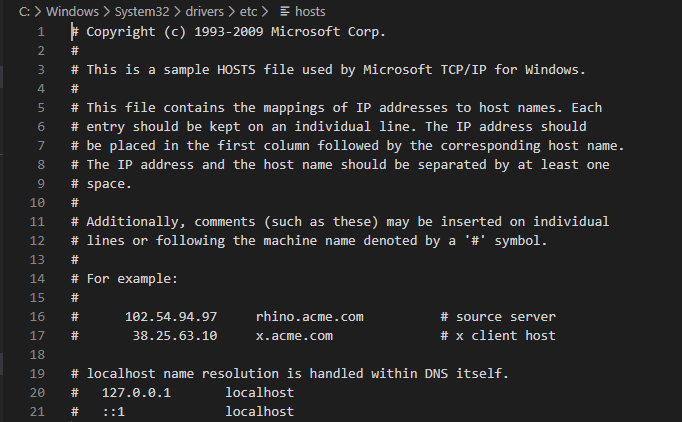
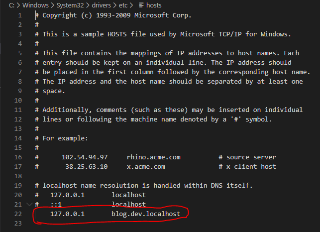

# Pasos para correr el API en localhost

### 1. Creación de Virtual Host con XAMPP en Windows

1.1 Para empezar con la creación de un virtual host, comenzaremos modificando el archivo **host**, el cual se encuentra en la siguiente ruta : 

> C:\Windows\System32\drivers\etc

Al abrir el archivo vamos a tener un contenido similar a este :



Lo que haremos acontinuación sera agregar un DNS que apunte al localhost (127.0.0.1). 



Solo queda guardar el archivo y listo.

*NOTA: Abrir el archivo con permisos de Administrador*

---

1.2 Ahora modificaremos el archivo **httpd-vhosts.conf**, el cual se encuentra en la siguiente ruta : 

> C:\xampp\apache\conf\extra

Abrimos el archivo y pegamos la siguiente configuración : 

```
 <VirtualHost *>
  DocumentRoot "ruta_del_proyecto\blog\servidor\public"
  ServerName "DNS que establecimos en el archivo **host**" *(Sin comillas "")*
  <Directory "ruta_del_proyecto\blog\servidor\public">
    AllowOverride All
    Require all granted
  </Directory>
 </VirtualHost>
 ```

Guardamos el archivo y listo.

*NOTA: Abrir el archivo con permisos de Administrador*

### 2. Ejecutar el .sql del proyecto

Ahora ejecutaremos el ini.sql que se encuetra en la carpeta **sql**.

Una vez ejecutado el ini.sql, ya estara lista la api para ser usada.

 


